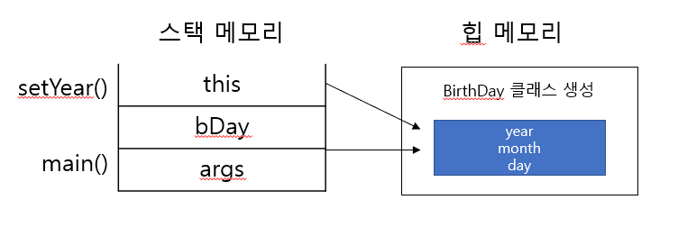

10/12 (수)
---
05장에서 인스턴스를 가리키는 변수가 참조 변수이며, 참조 변수를 출력하면 '클래스이름@메모리 주소' 문자열 값이 나온다고 했다. (p.150)

```java
class BirthDay {
    int day;
    int month;
    int year;

    public void setYear(int year) {
        this.year = year;
    }

    public void printThis() {
        System.out.println(this);
    }
}

public class ThisExample {

    public static void main(String[] args) {
        BirthDay bDAy = new BirthDay();
        bDAy.setYear(2000);
        System.out.println(bDAy);
        bDAy.printThis();
    }
}
```
```dtd
출력결과 >>
Chapter06.BirthDay@3ac3fd8b
Chapter06.BirthDay@3ac3fd8b
```
출력 결과를 보면 bDay.printThis() 메서드를 호출하여 출력한 this 값이 참조 변수 bDay를 출력한 값과 같다.
즉 클래스 코드에서 사용하는 this는 생성된 인스턴스 자신을 가리키는 역할을 한다. 따라서 this.year = year; 문장으로 참조하면 동적 메모리(힙 메모리)에 생성된 인스턴스의 year 변수 위치를 가리키고 그 위치에 매개변수 값을 넣어 주는 것이다.


**주의**
```java
class Person {
    String name;
    int age;
    
    Person() {
        // this.name = name;    *에러남*
        this("이름 없음", 1);
    }
    
    Person(String name, int age) {
        this.name = name;
        this.age = age;
    }
}
```
생성자는 클래스가 생성될 때 호출되므로 클래스 생성이 완료되지 않은 시점에 다른 코드가 있다면 오류가 발생할 수 있다.
즉 디폴드 생성자에서 생성이 완료되는 것이 아니라 this를 사용해 다른 생성자를 호출하므로, 이때는 this를 활용한 문장이 가장 먼저 와야 한다.

```java
package Chapter06;

public class CallAnotherConst {
    public static void main(String[] args) {
        Person noName = new Person();
        System.out.println(noName.name);
        System.out.println(noName.age);

        Person p = noName.returnItSelf();
        System.out.println(p);
        System.out.println(noName);
    }
}


class Person {
    String name;
    int age;

    Person() {
        this("이름 없음", 1);
    }

    Person(String name, int age) {
        this.name = name;
        this.age = age;
    }

    Person returnItSelf() {
        return this;    // this 반환
    }
}

```
```dtd
출력결과 >>
이름 없음
1
Chapter06.Person@3ac3fd8b
Chapter06.Person@3ac3fd8b
```
클래스 자료형과 상관없이 클래스 내에서 this를 사용하면 자신의 주소 값을 반환할 수 있다.

[참조] <br>
https://yaboong.github.io/java/2018/05/26/java-memory-management/ <br>
http://ojc.asia/bbs/board.php?bo_table=LecJava&wr_id=520

## 10/16 (일)
###static 변수란?<br>
- 다른 용어로 `정적 변수` 라고도 한다.
- 클래스 내부에 선언하지만, 프로그램이 실행되어 메모리에 올라갔을 때 딱 한 번 메모리 공간이 할당된다.
  - 일반 멤버 변수는 인스턴스가 생성될 때마다 새로 생성되지만, static으로 선언한 변수는 인스턴스 생성과 상관없이 먼저 생성되고 그 값을 모든 인스턴스가 공유하게 된다.
- 값은 모든 인스턴스가 공유한다.
- static 변수를 클래스에 기반한 변수라고 해서 `클래스 변수`라고도 한다.


static으로 선언한 serialNum 변수는 모든 인스턴스가 공유하기 때문에 두 개의 참조변수가 동일한 변수의 메모리를 가리킨다.

####클래스 메서드
- static 변수를 위한 메서드 `static 메서드` 또는 `클래스 메서드`라고 한다.

```java
package Chapter06.staticEx;

public class Student2 {
    private static int serialNum = 1000;
    public String studentName;
    

    public static int getSerialNum() {
        int i = 10;
        studentName = "이지원";    // 오류 발생
        return serialNum;
    }

}
```
`getSerialNum()`메서드는 static 예약어를 붙인 클래스 메서드이다.
- int i = 10;
    - 이 변수는 메서드 내부에서 선언했다. `지역 변수`이다. 지역 변수는 메서드가 호출될 때 메모리에 생성되어 메서드가 끝나면 사라지는 변수이다. 따라서 getSerialNum() 메서드 내부에서만 사용이 가능하다.
    
- return serialNum;
    - serialNum 변수는 static 변수이다. 그러므로 클래스 메서드인 getSerialNum() 메서드 내부에서도 사용이 가능하다.
    
- studentName = "이지원";
    - 이 변수는 Student2클래스의 멤버 변수로, 인스턴스가 생성될 때 만들어지는 인스턴스 변수이기 때문에 오류가 발생한다.
    
> 정리: 클래서 메서드(`getSerialNum()`) 내부에서 지역 변수(`int i = 10`)와 클래스 변수(`serialNum`)는 사용할 수 있지만 인스턴스 변수(`studentName`)은 사용할 수 없다. 
> <br>반대로 일반 메서드에서 클래스 변수를 사용하는 것은 전혀 문제가 되지 않는다. <br>
> 왜냐하면, 일반 메서드는 인스턴스가 생성될 때 호출하는 메서드이고, 클래스 변수는 이미 만들어진 변수이기 때문에 일반 메서드에서도 클래스 변수를 호출할 수 있다.

### 변수 유효 범위
1. 지역 변수의 유효 범위<br>
함수나 메서드 내부에 선언하기 때문에 함수 밖에서는 사용할 수 없다. 즉 하나의 함수에 선언한 지역 변수는 다른 함수에서 사용할 수 없다.
   지역 변수가 생성되는 메모리를 `스택`이라고 한다. 스택에 생성되는 지역 변수는 함수가 호출될 때 생성되었다가 함수가 반환되면 할당되었던 메모리 공간이 해제되면서 함께 없어진다.
   
2. 멤버 변수의 유효 범위<br>
멤버 변수는 인스턴스 변수라고 한다. 클래스가 생성될 때 `힙 메모리`에 생성되는 변수이다. 힙에 생성된 인스턴스가 `가비지 컬렉터`에 의해 수거되면 메모리에서 사라진다. 따라서 클래스 내부의 여러 메서드에서 사용할 변수는 멤버 변수로 선언하는 것이 좋다.
   
3. static 변수의 유효 범위<br>
사용자가 프로그램을 실행하면 메모리에 프로그램이 상주한다. 이때 프로그램 영역 중에 `데이터 영역`이 있다. 이 영역에는 상수나 문자열, static 변수가 생성된다.<br>
   인스턴스 변수는 객체가 생성되는 문장 즉 `new`가 생성되지만, static 변수는 클래스 생성과 상관 없이 처음부터 데이터 영역 메모리에 생성된다.
   
### 싱글톤 패턴이란?
객체 지향 프로그램에서 인스턴스를 단 하나만 생성하는 디자인 패턴을 `싱글톤 패턴`이라고 한다.

#### 구현하기

>1단계 : private 생성자 만들기
```java
package Chapter06.singleton;

public class Company {
    private Company() { }
}
```
생성자가 하나도 없는 클래스는 컴파일러가 자동으로 디폴트 생성자 코드를 넣어 준다. 그런데 만들어주는 디폴트 생성자는 항상 public이다.<br>
public이면 외부 클래스에서 인스턴스를 여러 개 생성할 수 있다. 따라서 싱글톤 패턴에서는 생성자를 반드시 명시적으로 만들고 그 접근 제어자를 private으로 지정해야 한다.

>2단계 : 클래스 내부에 static으로 유일한 인스턴스 생성하기
```java
package Chapter06.singleton;

public class Company {
    private Company() { }
    private static Company instance = new Company();    //유일하게 생성한 인스턴스
}
```
1단계에서 외부 인스턴스를 생성할 수 없도록 만들었다. 하지만 우리가 프로그램에서 사용할 인스턴스 하나는 필요하다. 따라서 Company 클래스 내부에서 하나으 인스턴스를 생성한다. 이 인스턴스가 프로그램 전체에서 사용할 유일한 인스턴스가 된다. 또한 private으로 선언하여 외부에서 이 인스턴스에 접근하지 못하도록 제한해야 인스턴스 오류를 방지할 수 있다.

>3단계 : 외부에서 참조할 수 있는 public 메서드 만들기
```java
package Chapter06.singleton;

public class Company {
    private Company() { }
    private static Company instance = new Company();    //유일하게 생성한 인스턴스
    
    public static Company getInstance() {
        if (instance == null) {
            instance = new Company();
        }
        
        return instance;
    }
}
```
private으로 선언한 유일한 인스턴스를 외부에서도 사용할 수 있도록 설정해야 한다. 이때 인스턴스를 반환하는 메서드는 반드시 static으로 선언해야 한다. 왜냐하면 getInstance() 메서드는 인스턴스 생성과 상관없이 호출할 수 있어야 하기 때문이다.

>4단계 : 실제로 사용하는 코드 만들기
```java
package Chapter06.singleton;

public class ComapnyTest {
    public static void main(String[] args) {
        Company myCompany1 = Company.getInstance();
        Company myCompany2 = Company.getInstance();
        System.out.println(myCompany1 == myCompany2);
    }
}
```