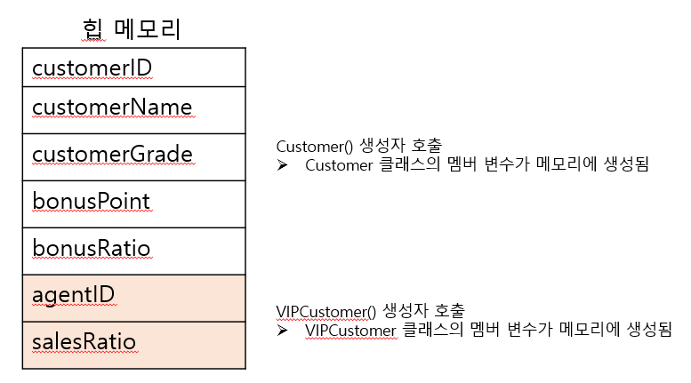

10/27 (목)
---
### 상위 클래스 변수를 사용하기 위한 protected 예약어
상위 클래스에 작성한 변수나 메서드 중 외부 클래스에서 사용할 수 없지만 하위 클래스에서는 사용할 수 없도록 지정하는 예약어가 바로 `proected`이다.<br>
즉, `protected`는 상속된 하위 클래스를 제외한 나머지 외부 클래스에서는 `private`과 동일한 역할을 한다.

### 상속에서 클래스 생성과 형 변환
하위 클래스가 생성될 때는 상위 클래스의 생성자가 먼저 호출된다.

```java
public class CustomerTest2 {
    public static void main(String[] args) {
        VIPCustomer customerKim = new VIPCustomer();
        customerKim.setCustomerID(10020);
        customerKim.setCustomerName("김유신");
        customerKim.bonusPoint = 10000;
        System.out.println(customerKim.showCustomerInfo());
    }
}
>>>
Customer() 생성자 호출
VIPCustomer() 생성자 호출
김유신 님의 등급은 VIP이며, 보너스 포인트는10000입니다.
```
상위 클래스의 Customer() 생성자가 먼저 호출되고 그 다음에 VIPCustomer()가 호출되는 것을 알 수 있다.


### 부모를 부르는 예약어, super
```java
public VIPCustomer() {
    super();
    customerGrade = "VIP";   // 상위 클래스에서 private 변수이므로 오류 발생
    bonusRatio = 0.05;  // 보너스 적립 5%
    saleRatio = 0.01;   // 할인율 10%
    System.out.println("VIPCustomer() 생성자 호출");
}
```
컴파일러가 자동으로 추가하는 코드이다. (super)
상위 클래스의 Customer()가 호출된다.

오버라이딩
---
```java
Customer customerWho = new VIPCustomer(10010, "Who", 100);
int price = customerWho.calcPrice(10000);
customerWho.showCustomerInfo();
```
위 코드에서 calcPrice() 메서드는 `VIPCustomer`클래스의 메서드가 호출된다.<br>
여기서 `Customer 클래스`의 `calcPrice()`와 `VIPCustomer 클래스`의 `calcPrice() (재정의됨)`는 다른 메서드 주소를 가지고 있다.
반면, 재정의 되지 않은 `showCustomerInfo()`는 같은 메서드 주소를 가지고 있다.

다형성
---
하나의 코드가 여러가지 자료형으로 구현되어 실행되는 것.<br>
정보은닉, 상속과 더불러 객체지향 프로그래밍의 가장 큰 특징 중 하나<br>
객체지향 프로그래밍의 유연성, 재활용성, 유지보수성에 기본이 되는 특징이다.

다운캐스팅
---
상위 클래스로 형 변환되었던 하위 클래스를 다시 원래 자료형으로 형 변환하는 것을 다운 캐스팅 이라고 한다.