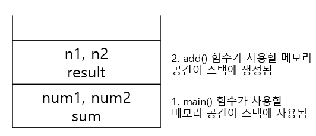
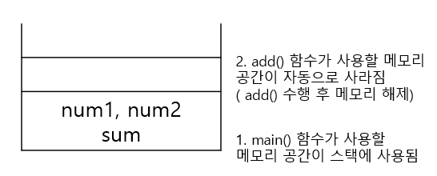

10/06 (목)
--
자바에서는 데이터 타입에 크게 두 가지가 있다.
- 원시 타입(Primitive Type)
- 참조 타입(Reference Type)

**1. 원시 타입**
- 정수, 실수, 문자, 논리 리터럴등의 **실제 데이터 값을 저장하는 타입**
    - boolean, char, byte, short, int, long, float, double

**2. 참조 타입**
- 객체(Object)의 번지를 참조(주소를 저장)하는 타입으로 **메모리 번지 값을 통해 객체를 참조하는 타입**
    - 원시 타입을 제외한 타입들(문자열, 배열, 열거, 클래스, 인터페이스)
    - `실제객체`는 `힙 영역`에 저장되며, `참조 타입 변수`는 `스택 영역`에 실제 객체들의 주소를 저장하여 객체를 사용할때 마다 참조 변수에 저장되 객체의 주소를 불러와 사용함
    
**스택(Stack)영역**
- `기본타입` 변수가 할당되고 변수의 실제 값들이 저장된다.
- `참조타입` 변수들은 스택 영역에 힙 영역에 생성된 객체들의 주소 값을 저장하고 있는다.

**힙(Heap)영역**
- 객체와 배열이 생성된다.
- `참조타입`(배열, 클래스, 인터페이스)들이 `객체들의 주소`를 `스택 영역`에 저장한다.
- 기본타입 변수들과는 달리 크기가 정해져 있지 않다.
- 프로그램 실행시 메모리에 동적으로 할당된다.
- 참조하는 변수가 없으면 자바의 `가비지 컬렉터`가 제거한다.
```
가비지 컬렉터(Garbage Collector): 메모리의 힙 영역에 할당된 더 이상 사용되지 않는 객체를 제거 하는 역할
```

[참조] https://velog.io/@gillog/%EC%9B%90%EC%8B%9C%ED%83%80%EC%9E%85-%EC%B0%B8%EC%A1%B0%ED%83%80%EC%9E%85Primitive-Type-Reference-Type

10/10(월)
--
**함수 호출과 스택 메모리**
함수를 호출하면 그 함수만을 위한 메모리 공간이 할당 되는데, 이 메모리 공간을 스택(Stack)이라고 한다.

```java
    public static void main(String[] args) {
        int num1 = 10;
        int num2 = 20;

        int sum = add(num1, num2);
        System.out.println(num1 + " + " + num2 + " = " + sum + "입니다.");
    }

    public static int add(int n1, int n2) {
        int result = n1 + n2;
        return result;
    }
```
**Step1**



**Step2**




**프로그램을 시작하는 main( ) 함수**
- main( )함수는 `자바 가상 머신(Java Virtual Machine; JVM)`이 프로그램을 시작하기 위해 호출하는 함수이다.
- 클래스 내부에 만들지만, 클래스의 메서드는 아니다.

**클래스 생성**
- 클래스가 생성된다는 것은 클래스를 실제 사용할 수 있도록 `메모리 공간(힙 메모리)`을 할당 받는다는 뜻이다.
- 이렇게 실제로 사용할 수 있도록 생성된 클래스를 `인스턴스`라고 한다.
- 인스턴스를 가리키는 클래스형 변수를 `참조 변수`라고 한다.

ex)
`Student`클래스 자료형으로 `studentAhn`변수를 선언하고 `new Student();`로 Student클래스를 생성하여 studentAhn에 대입한다는 뜻이다.
이때 studentAhn을 `참조 변수`라고 하고, 이변 변수가 생성된 인스턴스를 가리킨다.
```java
Student studentAhn = new Student();
```

**객체와 인스턴스 차이**
- 인스턴스: 클래스가 메모리 공간에 생성된 상태
- 객체: 클래스의 인스턴스
- 클래스의 타입으로 선언되었을 때 객체라고 부르고, 그 객체가 메모리에 할당되어 실제 사용될 때 인스턴스라고 부른다.
```java
Animal cat, dog;        // 객체

// 인스턴스화
cat = new Animal();     // cat은 Animal클래스의 '인스턴스'(객체를 메모리에 할당)
dog = new Animal();     // dog은 Animal클래스의 '인스턴스'(객체를 메모리에 할당)
/*
 생성자를 두 번 사용하여 서로 다른 변수 이름으로 클래스를 두 개 생성했다.
 즉, 서로 다른 인스턴스(cat, dog)가 두 개 생성되었다.       
 */
```
```java
studentAhn.studentName = "안연수";                     // 멤버 변수 사용
System.out.println(studentAhn.getSutdentName());      // 메서드 사용
```

**인스턴스와 힙 메모리**
```java
Student studentAhn = new Student();
```
- 위와 같이 생성된 클래스(`new Student()`)를 studentAhn 변수에 대입하면, 인스턴스가 저장된 메모리(`힙 메모리`)를 studentAhn 변수가 가리킨다. 

| 스택 메모리 | 힙 메모리 |
|:-----------|:------------------|
| studentAhn ---> | Student 클래스 생성 |
- studentAhn 변수는 `지역변수`이다.
- 인스턴스는 `힙 메모리`에 생성된다.
```dtd
힙 메모리란?
동적 메모리 공간을 말한다.
객체가 생성될 때 사용하는 공간이 힙이다.
자바에서는 가비지 컬렉터가 자동으로 메모리를 헤제해 준다.
```
**생성자란?**
- 클래스를 처음 만들 때 멤버 변수나 상수를 초기화하는 것
- 생성자가 없는 클래스는 클래스 파일을 컴파일할 때 자바 컴파일러에서 자동으로 생성자를 만들어 준다.(디폴트 생성자)

**생성자 오버로드**
- 생성자가 두 개 이상 제공되는 경우

**정보 은닉이란?**
- 클래스 내부에서 사용할 변수나 메서드는 private으로 선언해서 외부에서 접근하지 못하도록 하는 것.
- 자바에서는 접근 제어자를 사용하여 정보 은닉을 구현한다.

| 접근 제어자 | 설명 |
|:---------:|:---------:|
| public | 외부 클래스 어디에서나 접근할 수 있다. |
| protected | 같은 패키지 내부의 상속 관계의 클래스에서만 접근할 수 있고 그 외 클래스에서는 접근할 수 없다. |
| 아무것도 없는 경우 | default이며 같은 패키지 내부에서만 접근할 수 있다. |
| private | 같은 클래스 내부에서만 접근할 수 있다. |