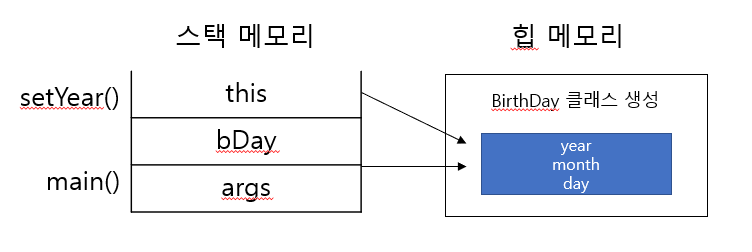

10/12 (수)
---
05장에서 인스턴스를 가리키는 변수가 참조 변수이며, 참조 변수를 출력하면 '클래스이름@메모리 주소' 문자열 값이 나온다고 했다. (p.150)

```java
class BirthDay {
    int day;
    int month;
    int year;

    public void setYear(int year) {
        this.year = year;
    }

    public void printThis() {
        System.out.println(this);
    }
}

public class ThisExample {

    public static void main(String[] args) {
        BirthDay bDAy = new BirthDay();
        bDAy.setYear(2000);
        System.out.println(bDAy);
        bDAy.printThis();
    }
}
```
```dtd
출력결과 >>
Chapter06.BirthDay@3ac3fd8b
Chapter06.BirthDay@3ac3fd8b
```
출력 결과를 보면 bDay.printThis() 메서드를 호출하여 출력한 this 값이 참조 변수 bDay를 출력한 값과 같다.
즉 클래스 코드에서 사용하는 this는 생성된 인스턴스 자신을 가리키는 역할을 한다. 따라서 this.year = year; 문장으로 참조하면 동적 메모리(힙 메모리)에 생성된 인스턴스의 year 변수 위치를 가리키고 그 위치에 매개변수 값을 넣어 주는 것이다.


**주의**
```java
class Person {
    String name;
    int age;
    
    Person() {
        // this.name = name;    *에러남*
        this("이름 없음", 1);
    }
    
    Person(String name, int age) {
        this.name = name;
        this.age = age;
    }
}
```
생성자는 클래스가 생성될 때 호출되므로 클래스 생성이 완료되지 않은 시점에 다른 코드가 있다면 오류가 발생할 수 있다.
즉 디폴드 생성자에서 생성이 완료되는 것이 아니라 this를 사용해 다른 생성자를 호출하므로, 이때는 this를 활용한 문장이 가장 먼저 와야 한다.

```java
package Chapter06;

public class CallAnotherConst {
    public static void main(String[] args) {
        Person noName = new Person();
        System.out.println(noName.name);
        System.out.println(noName.age);

        Person p = noName.returnItSelf();
        System.out.println(p);
        System.out.println(noName);
    }
}


class Person {
    String name;
    int age;

    Person() {
        this("이름 없음", 1);
    }

    Person(String name, int age) {
        this.name = name;
        this.age = age;
    }

    Person returnItSelf() {
        return this;    // this 반환
    }
}

```
```dtd
출력결과 >>
이름 없음
1
Chapter06.Person@3ac3fd8b
Chapter06.Person@3ac3fd8b
```
클래스 자료형과 상관없이 클래스 내에서 this를 사용하면 자신의 주소 값을 반환할 수 있다.

[참조] <br>
https://yaboong.github.io/java/2018/05/26/java-memory-management/ <br>
http://ojc.asia/bbs/board.php?bo_table=LecJava&wr_id=520